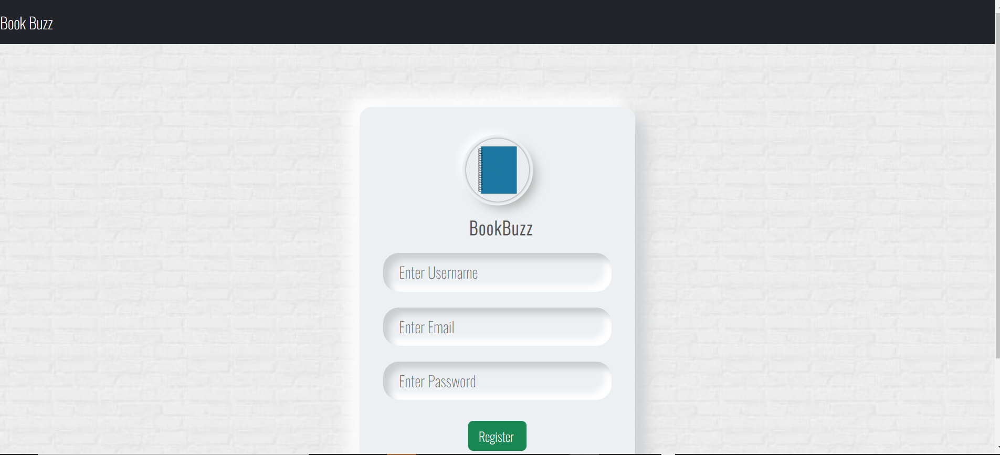
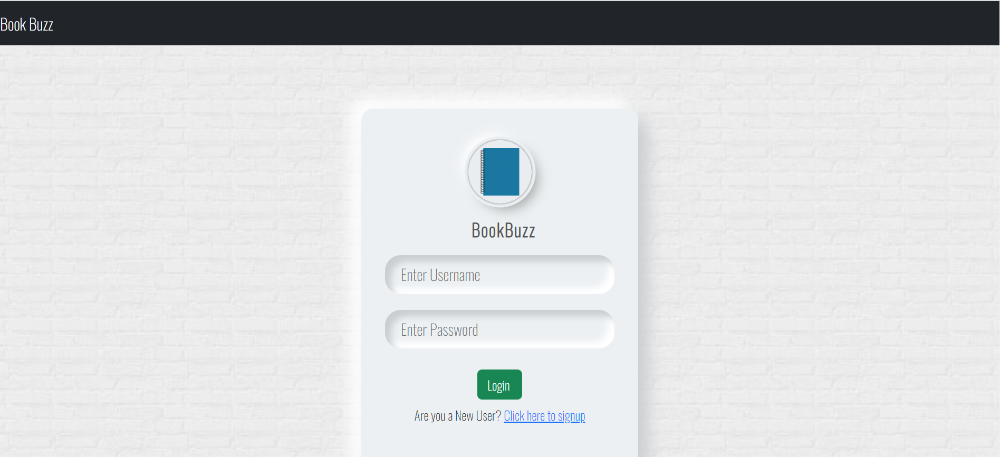
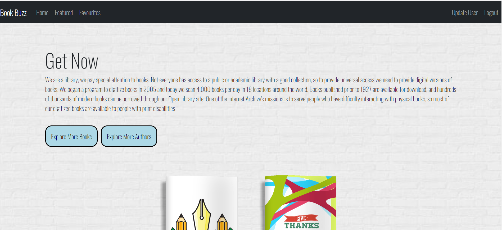
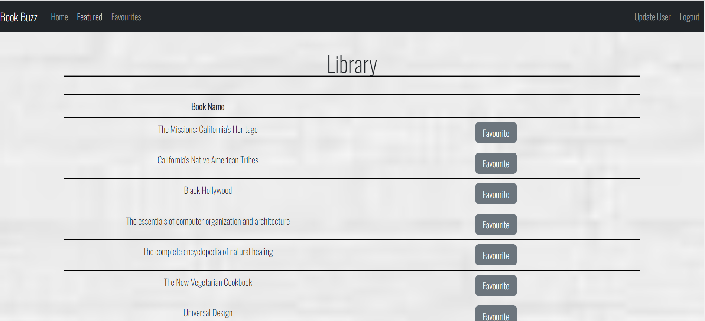
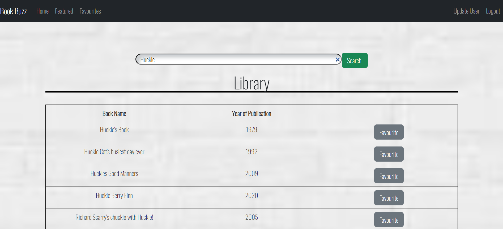
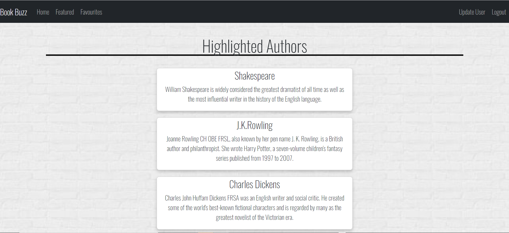
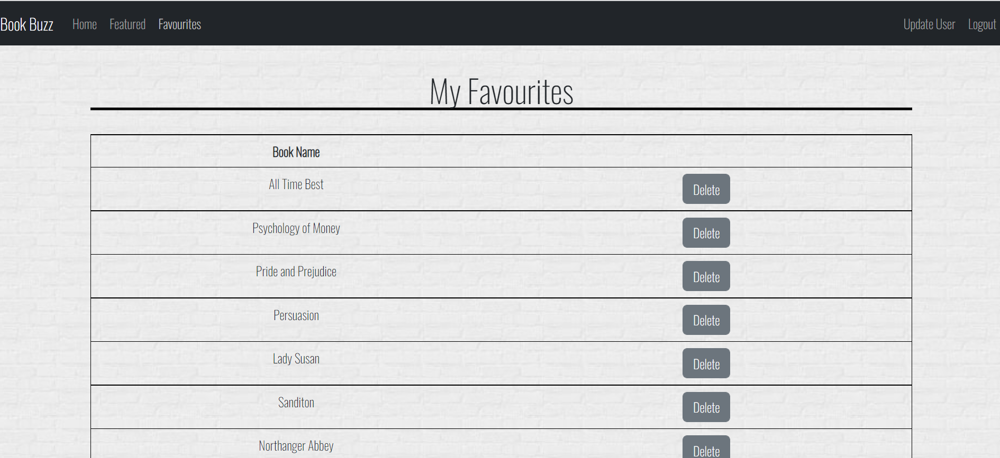
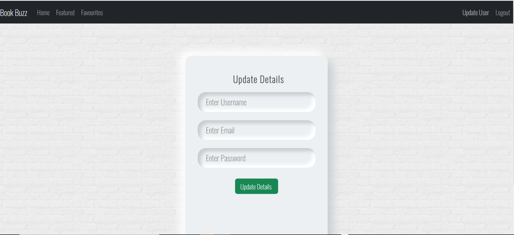

This is a project that has been done to demonstrate the skills that has been learnt during the course training 

Register Page

 

Login Page

 

Home Page

 

List of Featured Books

Search Page

Authors Page

My Favourites

Update User Details

